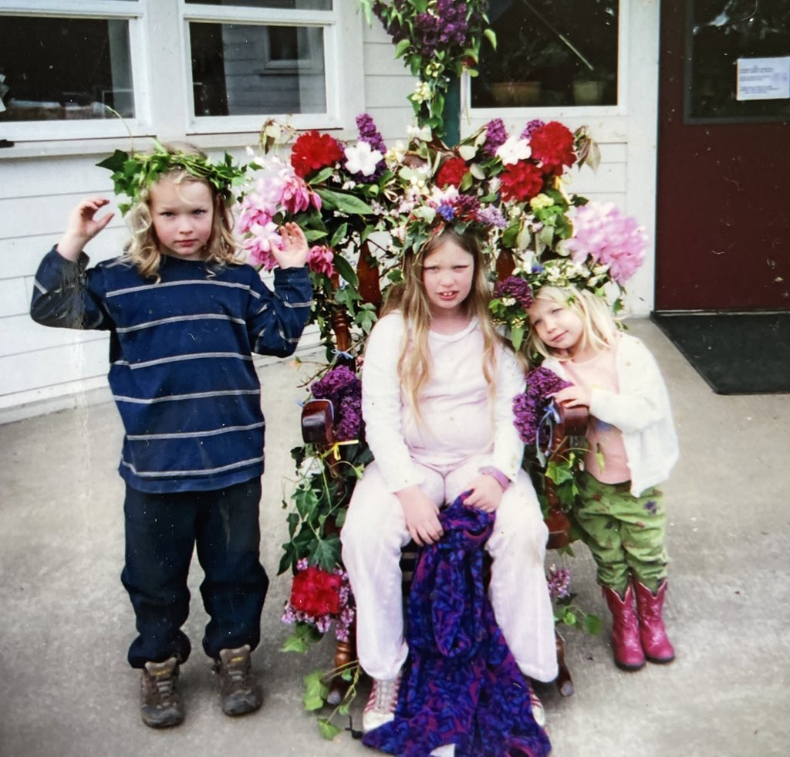
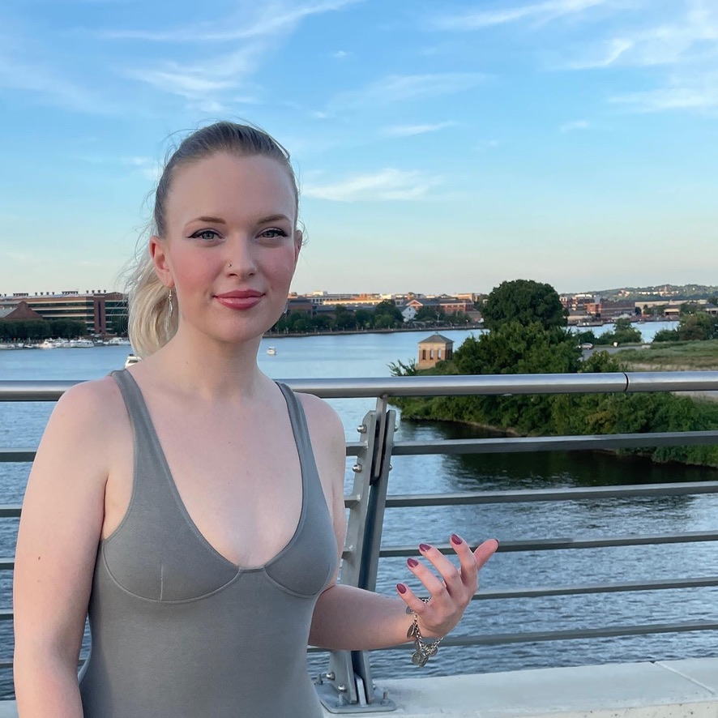
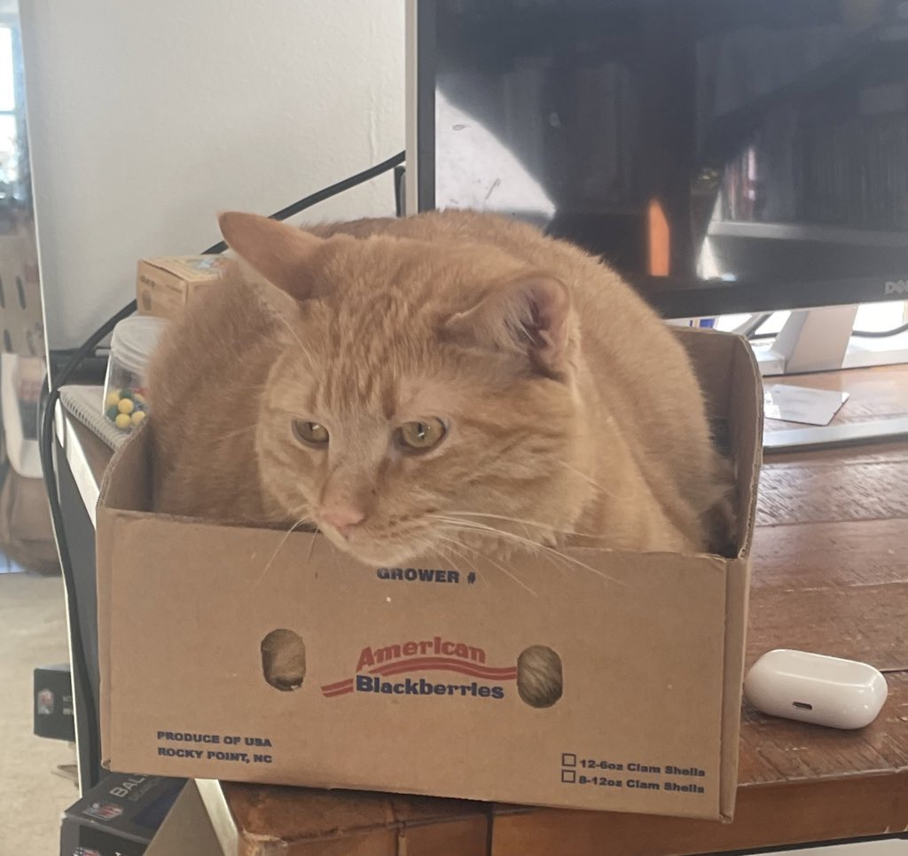

# About Me
Thank you for coming to my website. 

I am a 4th year Immunology PhD candidate in [Dr. Elana Fertig](https://fertiglab.com/) and [Dr. Genevieve Stein O'Brien](http://www.steinobrienlab.org/)'s labs in the Oncology/Biostatistcs and Neuroscience departments at Johns Hopkins. I am also part of the Convergence Institute. I am absolutely in love with my lab group, which I joined in Summer 2021. 

I'm interested in studying the human immune system in cancer using math and computation. Currently I am working on genomics-defined, agent-based models of pancreatic precancer.

My career goal is to keep working in research, and I will pursue a postdoc after graduation.

[CV](./cv.html).

  |   
  | 
